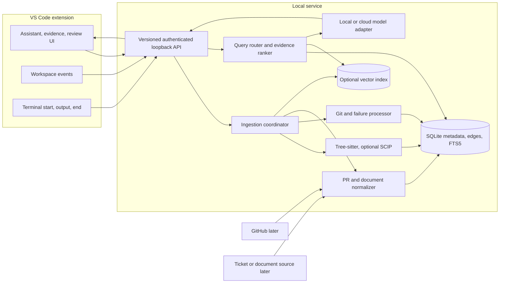

# CodeMind architecture

**Status:** target design. Phase 1 now implements the chat panel, local service lifecycle, and Hello exchange; the remaining components specify the TypeScript/JavaScript VS Code investor release in [BUILD_PLAN.md](BUILD_PLAN.md).

## Product boundary

CodeMind answers code-path and failure questions with inspectable evidence. The first release runs a VS Code extension and local service against one developer's repository. It indexes code, local Git history, and retained terminal failures. GitHub and one read-only team-record source add context after local code answers work. The developer reviews any proposed edit or publication.

Each answer identifies its repository and revision, links to source evidence, labels inferred relationships, and shows when the index is stale. An LLM summary or vector match is never a source of truth.

## System view



GitHub webhooks cannot be assumed to reach a developer's local service. The first connected release uses authorized polling. A later team deployment may add a hosted webhook receiver and queue. GitHub and team records are read-only inputs until reviewed write flows exist.

## Ownership and interfaces

| Component | Responsibility |
|---|---|
| Extension | UI, workspace and terminal events, source navigation, consent, review, service lifecycle. |
| Local API | Version handshake, loopback authentication, request IDs, cancellation, bounded payloads, health. |
| Ingestion | Debounce, deduplicate, apply ignore rules, snapshot revisions, update indexes atomically, report freshness. |
| Code adapters | Syntax entities and ranges; optional SCIP definitions/references; supported framework routes. |
| Stores | Canonical records, typed edges, lexical index, optional semantic index joined by source IDs. |
| Query layer | Intent routing, exact/graph/semantic retrieval, revision and permission filters, bounded ranking. |
| Model adapter | Bounded prompts, selected provider, streaming, citation validation. |
| Review UI | Show patch or external draft and require an explicit action before writing. |

The extension sends events and queries to a versioned JSON API on localhost. The service binds to loopback, receives a per-session random token through extension-managed startup, and rejects unauthenticated calls. Initial operations are `health`, `index.start`, `index.status`, `index.cancel`, `search`, `trace`, `ask` (streamed), `history.search`, `feedback`, and `suggestion.preview`. Requests include repository identity and revision policy; long tasks support cancellation. A team-hosted service would need a separate auth and deployment design.

## Ingestion and revisions

### Repository code

1. On open, scan the selected repository only after Workspace Trust permits it. Respect `.gitignore`, explicit exclusions, file size limits, and binary detection.
2. Keep `HEAD` and the working tree as separate views. Hash content to avoid reparsing unchanged files. Mark unsaved or uncommitted evidence in the UI.
3. Tree-sitter extracts named entities, imports, exports, syntax calls, and exact ranges. It supplies syntax, not compiler-proven cross-file relationships.
4. Import SCIP occurrences where an indexer runs successfully. Record coverage and errors. Retain syntax/search fallback for missing files.
5. On save, rename, delete, branch switch, or new commit, replace affected records atomically and invalidate dependent edges/chunks. If an update fails, the last good snapshot stays readable but is marked stale.

### Git and terminal failures

- Index local commit metadata, changed paths, diffs, and hunk locations with commit hashes.
- Start reading each VS Code terminal execution at the **start event**; waiting for the end event can miss output. The end event supplies an exit code when available. Bound output, remove control sequences for display, and redact secrets before storage or model use.
- Store a failure fingerprint, observed source locations, and the retained output excerpt. Link a prior failure to a commit only through an explicit CI/issue association or label it as a similarity candidate. A commit alone does not prove which error it fixed.
- If shell integration or an exit code is unavailable, show the limitation and provide manual pasted-error investigation.

### Team records and semantic chunks

- GitHub PRs and one ticket/document provider use read-only, permission-scoped connectors. Store source URL, external ID, update time, access scope, and excerpt. Sync must be idempotent and remove revoked/deleted records.
- Documents show design intent; current code and tests establish implemented behavior. Proposed documentation or ticket updates remain drafts for review.
- Chunk code by symbol and documents by section, preserving canonical IDs and revision. Embeddings are optional and only for allowed content. Exact names, paths, error codes, and graph queries work without vectors.

## Canonical records

SQLite is the first canonical store, with edge tables and FTS5. Graph, lexical, and optional vector indexes join through stable IDs.

| Record | Required fields |
|---|---|
| Source | `source_id`, tenant/repository ID, type, revision, path or URL, content hash, indexed time, access scope |
| Span | `span_id`, source ID, start/end line, optional symbol ID, text reference |
| Symbol | ID, name, kind, language, definition span, precision coverage |
| Edge | From/to IDs, type, evidence span, provenance, confidence, revision |
| Execution | ID, repository, start time, displayed command, exit code or unknown, output reference, redaction state |
| External record | Provider ID, source ID, last modified time, sync status |

Edges include `DEFINES`, `IMPORTS`, `REFERENCES`, `CALLS`, `ROUTE_TO`, `QUERIES`, `CHANGED_IN`, and `MENTIONED_BY`. Provenance identifies `scip`, `syntax`, `framework`, `explicit_external_link`, or `model_inferred`. Confidence does not replace provenance. A multi-hop path inherits its weakest link. Citations resolve against the revision shown in the answer; an old citation must not silently point to a moved current line.

## Query and answer path

```mermaid
sequenceDiagram
  participant D as Developer
  participant E as Extension
  participant S as Local service
  participant I as Indexes
  participant M as Model
  D->>E: Question or failed command
  E->>S: Query + repository + revision policy
  S->>I: Exact search + symbol resolution + bounded graph traversal
  S->>I: Semantic/history search when useful and available
  I-->>S: Evidence with IDs, provenance and revision
  S->>S: Filter access/revision; rank and cap context
  S->>M: Question + bounded evidence + citation IDs
  M-->>S: Draft answer
  S->>S: Validate citation IDs and locations
  S-->>E: Answer + evidence + freshness + uncertainty
  E-->>D: Clickable answer and optional reviewed action
```

Route identifiers, file names, endpoints, and error codes through lexical search first. Route callers and impact questions through symbol resolution and bounded graph traversal. Route broad questions through lexical and optional semantic search, followed by graph expansion. Route historical failures through exact terms/fingerprints, then similarity and explicit commit/PR/CI links. A similarity result must not be presented as a verified prior fix.

Rank by exactness, provenance, revision compatibility, access rights, and freshness. Cap graph depth, result count, output length, and model tokens. Validate citation IDs against retrieved spans. If evidence is insufficient, return the inspected evidence and state the gap.

## Model, privacy, and actions

- Local mode sends prompts to a configured local runtime. Optional cloud mode displays the provider and requires an explicit setting before source excerpts leave the machine. Local inference alone does not guarantee privacy if connectors or telemetry are active.
- Treat source code, PRs, documents, and terminal output as untrusted data. Embedded instructions cannot override product rules or trigger tools.
- Store connector tokens in VS Code secret storage or the OS keychain; use minimum scopes and support revocation and deletion of synced records. Keep tenants and repositories isolated in retrieval.
- Honor Workspace Trust. No repository command execution or model tool action in Restricted Mode. Do not log tokens, full prompts, code, or terminal streams by default.
- Patch application, command execution, ticket changes, and document publication are separate reviewed actions with an audit record. Indexing and answering are read-only.

## Release boundary and verification

The investor release covers TypeScript/JavaScript in VS Code: incremental indexing, lexical and graph retrieval, file/line citations, configured model, terminal failure capture, local Git history, and one read-only team-record integration. It ships with a reproducible sample repository and evaluation report. See [INVESTOR_DEMO.md](INVESTOR_DEMO.md).

After that release: additional languages, hosted team sync, opt-in screen analysis, verified patch automation, and dedicated graph/vector infrastructure if scale measurements require it.

Verification must cover save/rename/delete/branch-switch invalidation; known definitions and callers; terminal output from the start event plus unknown exits; citation validation at the indexed revision; trusted/untrusted workspaces; connector revocation; and a clean-install investor rehearsal. Publish measured accuracy and latency, not estimated claims.

## Technical references

- [VS Code terminal shell integration introduced in 1.93](https://code.visualstudio.com/updates/v1_93)
- [VS Code terminal stream and exit-code API](https://code.visualstudio.com/api/references/vscode-api)
- [VS Code Workspace Trust](https://code.visualstudio.com/api/extension-guides/workspace-trust)
- [Tree-sitter incremental parsing](https://tree-sitter.github.io/tree-sitter/)
- [SCIP precise navigation](https://sourcegraph.com/docs/code-navigation/precise-code-navigation)
- [GitHub webhook events](https://docs.github.com/en/webhooks/webhook-events-and-payloads)
